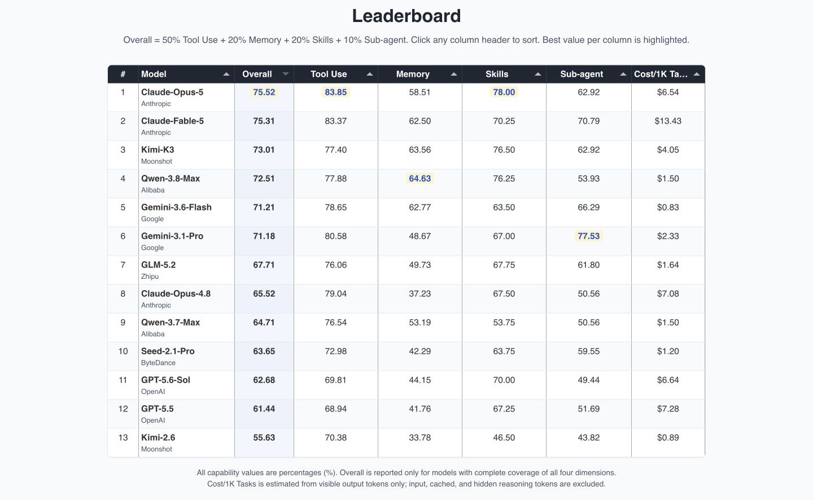
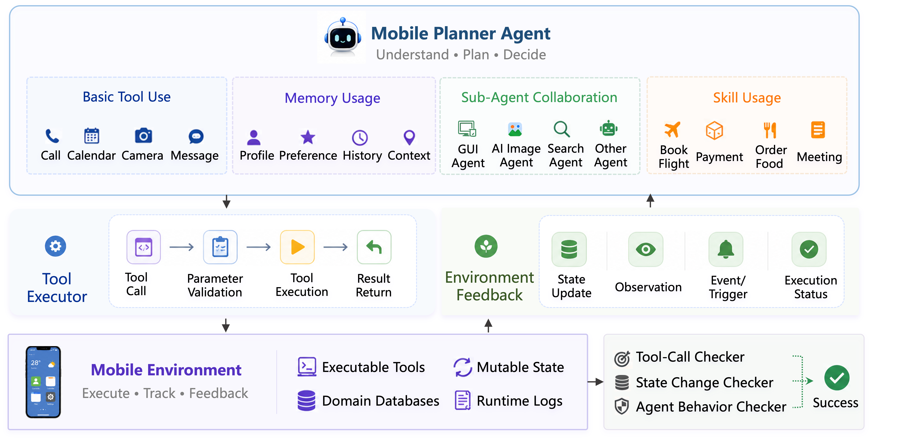

<div align="center">

# MobilePA-Bench

### Benchmarking Mobile Planner Agents on Complex Real-World Tasks

[Project Page](https://tongyi-mai.github.io/MobilePA-Bench/) ·
[Leaderboard](https://tongyi-mai.github.io/MobilePA-Bench/#leaderboard) ·
[Paper](https://arxiv.org/abs/2608.23035) ·
[Hugging Face](https://huggingface.co/papers/2608.23035) ·
[Private Evaluation](https://116.62.42.171/login?next=/submit) ·
[Issues](https://github.com/Tongyi-MAI/MobilePA-Bench/issues)

[](https://arxiv.org/abs/2608.23035)
[](https://github.com/Tongyi-MAI/MobilePA-Bench/actions/workflows/deploy-pages.yml)
[](https://github.com/Tongyi-MAI/MobilePA-Bench/commits/main)
[](LICENSE)

</div>

**MobilePA-Bench** is an interactive, stateful, and tool-centric benchmark for evaluating the tool-calling and planning capabilities of mobile planner agents. It moves beyond static function matching by executing agent actions in a mutable mobile environment and checking both the action trace and the resulting state.

<p align="center">
  <a href="https://tongyi-mai.github.io/MobilePA-Bench/#leaderboard">
    
  </a>
</p>

## Highlights

- **Executable and stateful:** tool calls run against an environment whose application data, permissions, and device state evolve after every action.
- **Broad mobile coverage:** 1,705 evaluation tasks exercise 212 realistic tools across 13 functional domains and 89 subcategories.
- **Four capability dimensions:** Tool Use, Memory Usage, Skill Usage, and Sub-agent Collaboration.
- **Evidence-based evaluation:** fixed policies verify tool selection, grounded arguments, execution order, final environment state, and agent behavior.
- **Realistic failure modes:** agents must handle tool dependencies, permission boundaries, conflicting requests, runtime errors, and incomplete user context.

## News

- **2026-08-25:** The project repository was opened with an interactive [project page](https://tongyi-mai.github.io/MobilePA-Bench/), [leaderboard](https://tongyi-mai.github.io/MobilePA-Bench/#leaderboard), and a [private-evaluation link](https://116.62.42.171/login?next=/submit).
- **2026-08-24:** The [MobilePA-Bench paper](https://arxiv.org/abs/2608.23035) was released on arXiv. 

## Benchmark at a Glance

| Benchmark scale | Value | Capability dimension | Tasks | Score weight |
| --- | ---: | --- | ---: | ---: |
| Evaluation tasks | **1,705** | Tool Use | **1,040** | **50%** |
| Realistic mobile tools | **212** | Memory Usage | **376** | **20%** |
| Functional domains | **13** | Skill Usage | **200** | **20%** |
| Level-2 subcategories | **89** | Sub-agent Collaboration | **89** | **10%** |
| Candidate tools recalled | **N = 15** |  |  |  |
| Maximum execution steps | **T = 15** |  |  |  |

## Overview

MobilePA-Bench models a mobile planning agent as a decision-maker operating through structured tools, reusable skills, persistent memory, and specialized sub-agents. The environment executes each action, updates its state, and returns observations or runtime errors that the agent must incorporate into subsequent decisions.

The evaluator assigns a fixed verification policy to each task. Depending on the task, success can require an exact tool call, a target state transition, a prescribed action order, or a valid collaboration pattern. This makes the benchmark sensitive to whether an agent actually completes a request—not merely whether it produces a plausible-looking response.

<p align="center">
  
</p>

### Capability Dimensions

| Dimension | What it measures |
| --- | --- |
| [Tool Use](https://tongyi-mai.github.io/MobilePA-Bench/#tool-use-examples) | Grounded tool selection, argument construction, ordered execution, recovery, and safe refusal |
| [Memory](https://tongyi-mai.github.io/MobilePA-Bench/#memory-examples) | Retrieval and application of user profiles, preferences, routines, history, and situational context |
| [Skill](https://tongyi-mai.github.io/MobilePA-Bench/#skill-examples) | Selection and execution of reusable composite procedures instead of rebuilding every workflow from scratch |
| [Sub-agent](https://tongyi-mai.github.io/MobilePA-Bench/#sub-agent-examples) | Task decomposition, contextual handoff, and coordination with GUI, search, image, and other specialized agents |


## Private Evaluation

We offer a confidential evaluation track for hosted mobile planner agents. Submit an HTTPS, OpenAI-compatible endpoint with tool-calling support, and MobilePA-Bench will evaluate the model across Tool Use, Memory Usage, Skill Usage, and Sub-agent Collaboration. To participate, [request a private evaluation](https://116.62.42.171/login?next=/submit) through our secure submission portal.

- **Confidential by design:** submissions go directly to the dedicated evaluation server; API credentials are never handled by GitHub Pages.
- **Hidden-test integrity:** benchmark queries, ground truth, and judge credentials remain isolated from submitted models.
- **Reviewed results:** each completed run is checked before its report is released to the submitting account.
- **Expected turnaround:** reports are normally returned within three business days, with one request allowed per account every seven days.

## Citation

If you find MobilePA-Bench useful in your research, please cite our paper:

```bibtex
@article{zhu2026mobilepabench,
  title         = {MobilePA-Bench: Benchmarking Mobile Planner Agents on Complex Real-World Tasks},
  author        = {Zhu, Yi and Wu, Xiongwei and Wang, Qiyi and Qu, Tingyu and Liu, Jiajun and Cao, Sihan and Chen, Long and Sun, Weigao and Zhu, Feida and Zhong, Yiran and Hoi, Steven},
  journal       = {arXiv preprint arXiv:2608.23035},
  year          = {2026},
  eprint        = {2608.23035},
  archivePrefix = {arXiv},
  primaryClass  = {cs.AI}
}
```

## Contact

For questions, evaluation requests, or collaboration proposals, please [open a GitHub issue](https://github.com/Tongyi-MAI/MobilePA-Bench/issues).

## License

Unless otherwise noted, this repository is licensed under the [Apache License 2.0](LICENSE).

---

<div align="center">
If MobilePA-Bench is useful to your work, please consider giving the repository a star ⭐
</div>
